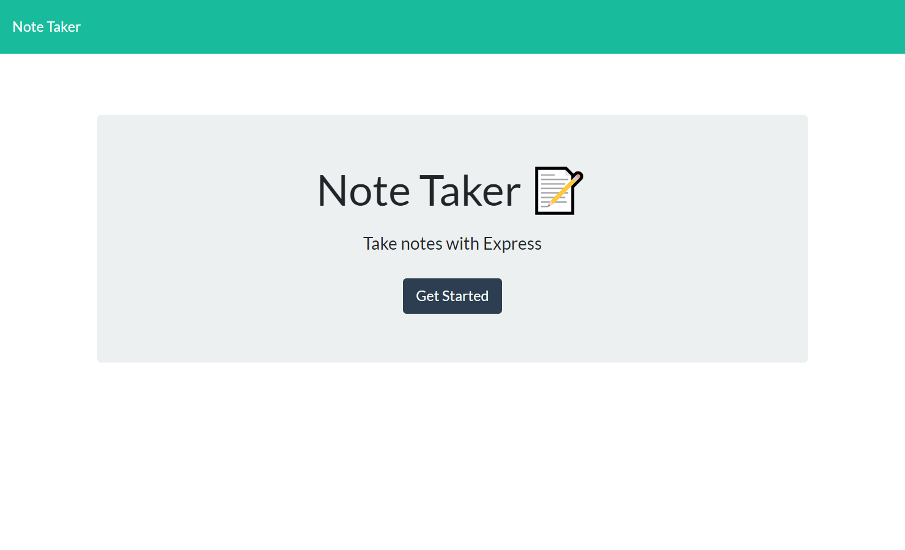

## NoteTaker

## Objective
The purpose of this project is to have an app that you can take notes in and the note will be saved.

## Table of Contents
  * [Installation](#installation)
  * [Usage](#usage)
  * [License](#license)
  * [Contributing](#contributing)
  * [Tests](#tests)
  * [Questions](#questions)

## Installation
It uses node to start code and run from the server.

## Contributing
Contributors include: Brian Gearty (tutor), and myself.

## License

This app was written under the MIT license.

## Screenshot
 

## Questions?
Reach out by email: boldsja@gmail.com

[Heroku Link](https://jab-note-taker.herokuapp.com/)

[Github Repo](https://github.com/boldsja/notes)

[Github](https://github.com/boldsja/) 

